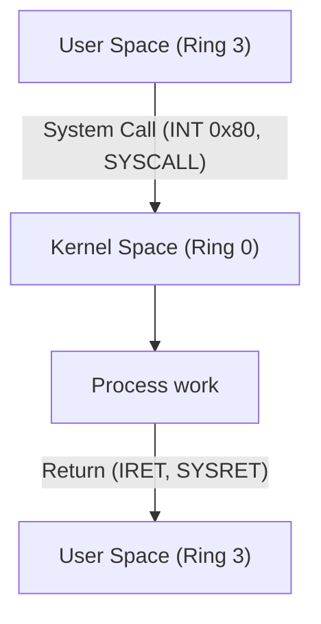

# GDT (Global Descriptor Table)

## 📋 İçindekiler

- [Genel Bakış](#genel-bakış)
- [GDT Nedir?](#gdt-nedir)
- [Neden Gereklidir?](#neden-gereklidir)
- [Segment Descriptor Yapısı](#segment-descriptor-yapısı)
- [Access Byte](#access-byte)
- [Granularity ve Flags](#granularity-ve-flags)
- [Flat Memory Model vs Segmented Model](#flat-memory-model-vs-segmented-model)
- [Ring Levels (Privilege Levels)](#ring-levels-privilege-levels)
- [GDT Yükleme](#gdt-yükleme)
- [KFS-1'de GDT Kullanımı](#kfs-1de-gdt-kullanımı)
- [Debug ve Troubleshooting](#debug-ve-troubleshooting)

---

## Genel Bakış

**GDT (Global Descriptor Table)**, x86 protected mode'da bellek segmentasyonunu tanımlayan bir tablodur. CPU, bellekteki her segmenti (kod, veri, stack) GDT üzerinden tanımlar ve erişim kontrolü yapar.

### GDT'nin Rolü:

- ✅ **Memory Protection**: Ring-based erişim kontrolü (Kernel vs User space)
- ✅ **Segment Definition**: Kod, veri, stack segmentlerini tanımlar
- ✅ **Address Translation**: Segment selector → Linear address
- ✅ **Privilege Enforcement**: Ring 0-3 ayrıcalık seviyeleri

---

## GDT Nedir?

GDT, **segment descriptor** adı verilen 8-byte'lık yapıların bir dizisidir. Her descriptor, bir bellek segmentini tanımlar:

```
┌──────────────────────────────────────────────┐
│           GDT (Global Descriptor Table)      │
├──────────────────────────────────────────────┤
│ Entry 0: NULL Descriptor (zorunlu, 8 bytes)  │
│ Entry 1: Kernel Code Segment (8 bytes)       │
│ Entry 2: Kernel Data Segment (8 bytes)       │
│ Entry 3: Kernel Stack Segment (8 bytes)      │
│ Entry 4: User Code Segment (8 bytes)         │
│ Entry 5: User Data Segment (8 bytes)         │
│ Entry 6: TSS (Task State Segment) (8 bytes)  │
│ ...                                          │
└──────────────────────────────────────────────┘
```

### Segment Selector:

CPU'nun segment register'ları (CS, DS, ES, FS, GS, SS) **segment selector** içerir:

```
┌─────────────┬─────┬─────┐
│    Index    │ TI  │ RPL │
│  (13 bit)   │(1b) │(2b) │
└─────────────┴─────┴─────┘
  15        3   2   1   0

Index: GDT'deki entry numarası
TI:    0 = GDT, 1 = LDT (Local Descriptor Table)
RPL:   Requested Privilege Level (0-3)
```

**Örnek:**
- `CS = 0x08` → GDT[1] (Kernel Code, Ring 0)
- `DS = 0x10` → GDT[2] (Kernel Data, Ring 0)
- `CS = 0x1B` → GDT[3] | RPL=3 (User Code, Ring 3)

---

## Neden Gereklidir?

### Protected Mode Gereksinimleri:

1. **Segment Register'lar boş olamaz**
   - Real mode'dan protected mode'a geçişte GDT zorunludur
   - CPU, segment register'larda geçerli selector bekler

2. **Memory Protection**
   - Kernel ve user code'u ayırır (Ring 0 vs Ring 3)
   - Yanlış erişimleri engeller (General Protection Fault - GPF)

3. **Standardizasyon**
   - Tüm x86 CPU'lar GDT kullanır
   - OS geliştirme için standart bir arayüz

### GDT Olmadan:

- ❌ Protected mode'a geçilemez
- ❌ Memory protection yok
- ❌ User/Kernel ayrımı yok
- ❌ Modern OS çalışamaz

---

## Segment Descriptor Yapısı

Her GDT entry **8 byte (64 bit)** uzunluğundadır:

```
┌───────┬──────┬────────┬──────┬───────┬─────────┬──────────┬──────────┐
│ 63-56 │55-52 │ 51-48  │47-40 │39-32  │ 31-16   │  15-0    │  Bit     │
├───────┼──────┼────────┼──────┼───────┼─────────┼──────────┼──────────┤
│Base   │Flags │Limit   │Access│Base   │Base     │Limit     │          │
│31-24  │      │19-16   │Byte  │23-16  │15-0     │15-0      │          │
└───────┴──────┴────────┴──────┴───────┴─────────┴──────────┴──────────┘
```

### Alanlar:

| Alan | Boyut | Açıklama |
|------|-------|----------|
| **Base** | 32 bit | Segmentin başlangıç adresi (4 parçaya bölünmüş) |
| **Limit** | 20 bit | Segmentin boyutu (2 parçaya bölünmüş) |
| **Access Byte** | 8 bit | Segment tipi, ring level, present bit |
| **Flags** | 4 bit | Granularity, size, long mode, reserved |

### C Struct:

```c
struct gdt_entry {
    uint16_t limit_low;    // Limit 0-15 bit
    uint16_t base_low;     // Base 0-15 bit
    uint8_t  base_mid;     // Base 16-23 bit
    uint8_t  access;       // Access byte
    uint8_t  gran;         // Limit 16-19 (low nibble) + Flags (high nibble)
    uint8_t  base_high;    // Base 24-31 bit
} __attribute__((packed));
```

---

## Access Byte

Access byte (8 bit) segmentin özelliklerini belirler:

```
┌───┬────┬───┬───┬───┬───┬───┬───┐
│ 7 │  6 │ 5 │ 4 │ 3 │ 2 │ 1 │ 0 │
├───┼────┼───┼───┼───┼───┼───┼───┤
│ P │ DPL│ S │ E │DC │RW │ A │   │
└───┴────┴───┴───┴───┴───┴───┴───┘
```

### Bit Açıklamaları:

| Bit | Alan | Açıklama |
|-----|------|----------|
| **7** | **P (Present)** | 1 = Segment geçerli, 0 = Geçersiz |
| **6-5** | **DPL** | Descriptor Privilege Level (0-3 ring) |
| **4** | **S (Descriptor Type)** | 1 = Code/Data, 0 = System |
| **3** | **E (Executable)** | 1 = Code segment, 0 = Data segment |
| **2** | **DC (Direction/Conforming)** | Code: conforming, Data: direction |
| **1** | **RW (Read/Write)** | Code: readable, Data: writable |
| **0** | **A (Accessed)** | CPU tarafından otomatik set edilir |

### Yaygın Access Byte Değerleri:

| Değer | Binary | Açıklama |
|-------|--------|----------|
| **0x9A** | 10011010 | Kernel Code (Ring 0, executable, readable) |
| **0x92** | 10010010 | Kernel Data (Ring 0, writable) |
| **0xFA** | 11111010 | User Code (Ring 3, executable, readable) |
| **0xF2** | 11110010 | User Data (Ring 3, writable) |
| **0x89** | 10001001 | TSS (Task State Segment) |

### Access Byte Hesaplama:

```c
// Kernel Code: Ring 0, Present, Code, Executable, Readable
access = (1 << 7) |   // P = 1 (present)
         (0 << 5) |   // DPL = 00 (ring 0)
         (1 << 4) |   // S = 1 (code/data)
         (1 << 3) |   // E = 1 (code)
         (0 << 2) |   // DC = 0 (non-conforming)
         (1 << 1) |   // RW = 1 (readable)
         (0 << 0);    // A = 0 (not accessed)
// Result: 0x9A

// User Data: Ring 3, Present, Data, Writable
access = (1 << 7) |   // P = 1
         (3 << 5) |   // DPL = 11 (ring 3)
         (1 << 4) |   // S = 1
         (0 << 3) |   // E = 0 (data)
         (0 << 2) |   // DC = 0 (expand up)
         (1 << 1) |   // RW = 1 (writable)
         (0 << 0);    // A = 0
// Result: 0xF2
```

---

## Granularity ve Flags

Granularity byte'ın üst 4 biti (flags) + alt 4 biti (limit 16-19):

```
┌───┬───┬───┬───┬────┬────┬────┬────┐
│ 7 │ 6 │ 5 │ 4 │  3 │  2 │  1 │  0 │
├───┼───┼───┼───┼────┼────┼────┼────┤
│ G │D/B│ L │Res│    Limit 19-16    │
└───┴───┴───┴───┴────┴────┴────┴────┘
```

### Bit Açıklamaları:

| Bit | Alan | Açıklama |
|-----|------|----------|
| **7** | **G (Granularity)** | 0 = 1 byte, 1 = 4 KB |
| **6** | **D/B (Size)** | 0 = 16-bit, 1 = 32-bit |
| **5** | **L (Long mode)** | 0 = 32-bit, 1 = 64-bit (x86_64) |
| **4** | **Reserved** | Her zaman 0 |
| **3-0** | **Limit 19-16** | Limit'in üst 4 biti |

### Granularity Etkisi:

| G | Limit | Gerçek Boyut |
|---|-------|--------------|
| 0 | 0xFFFF | 64 KB (65,536 bytes) |
| 1 | 0xFFFFF | 4 GB (1,048,575 × 4KB) |

### Yaygın Flags Değeri:

```c
gran = 0xCF;  // 11001111
// G = 1 (4KB granularity)
// D/B = 1 (32-bit)
// L = 0 (not 64-bit)
// Reserved = 0
// Limit 19-16 = 0xF
```

**Sonuç:** Limit 0xFFFFF + G=1 → 4 GB segment (flat memory)

---

## Flat Memory Model vs Segmented Model

### 🔷 Flat Memory Model (KFS-1'de kullanılan):

```
┌─────────────────────────────────────┐
│     0x00000000 - 0xFFFFFFFF         │
│        (4 GB Lineer Alan)           │
│                                     │
│  ┌─────────────────────────────┐    │
│  │   Kernel Code (Ring 0)      │    │ Base: 0x00000000
│  │   Segment: 0x08             │    │ Limit: 0xFFFFF (4GB)
│  └─────────────────────────────┘    │
│                                     │
│  ┌─────────────────────────────┐    │
│  │   Kernel Data (Ring 0)      │    │ Base: 0x00000000
│  │   Segment: 0x10             │    │ Limit: 0xFFFFF (4GB)
│  └─────────────────────────────┘    │
│                                     │
│  ┌─────────────────────────────┐    │
│  │   User Code (Ring 3)        │    │ Base: 0x00000000
│  │   Segment: 0x1B             │    │ Limit: 0xFFFFF (4GB)
│  └─────────────────────────────┘    │
│                                     │
└─────────────────────────────────────┘
```

**Özellikler:**
- Tüm segmentler aynı base (0x00000000)
- Tüm segmentler aynı limit (4 GB)
- Segmentasyon yalnızca **ring level** için kullanılır
- Gerçek bellek koruması **paging** ile yapılır

**Avantajlar:**
- ✅ Basit programlama modeli
- ✅ Modern OS'ler bu modeli kullanır
- ✅ Paging ile güçlü bellek koruması

### 🔶 Segmented Memory Model (Eski/Nadir):

```
┌─────────────────────────────────────┐
│        Kernel Code Segment          │ 0x00000000 - 0x000FFFFF (1 MB)
├─────────────────────────────────────┤
│        Kernel Data Segment          │ 0x00100000 - 0x001FFFFF (1 MB)
├─────────────────────────────────────┤
│        User Code Segment            │ 0x00400000 - 0x007FFFFF (4 MB)
├─────────────────────────────────────┤
│        User Data Segment            │ 0x00800000 - 0x00BFFFFF (4 MB)
└─────────────────────────────────────┘
```

**Özellikler:**
- Her segment farklı base/limit
- Segment-based memory protection
- Karmaşık adres hesaplama

**Dezavantajlar:**
- ❌ Karmaşık programlama
- ❌ Paging ile çakışma
- ❌ Modern OS'ler kullanmaz

### Neden Flat Model?

1. **Basitlik**: Tüm segmentler aynı adres aralığı
2. **Paging**: Modern bellek koruması paging ile yapılır
3. **Standart**: Linux, Windows, BSD hepsi flat model kullanır
4. **Performans**: Segment register reload'ları minimize edilir

---

## Ring Levels (Privilege Levels)

x86 CPU'ları **4 ayrıcalık seviyesi** (ring) destekler:

```
┌──────────────────────────────────────┐
│         Ring 0 (Kernel)              │ ← En yüksek ayrıcalık
│  - Kernel code                       │
│  - Device drivers                    │
│  - Full hardware access              │
├──────────────────────────────────────┤
│         Ring 1 (Unused)              │
│  - Device drivers (teoride)          │
├──────────────────────────────────────┤
│         Ring 2 (Unused)              │
│  - Device drivers (teoride)          │
├──────────────────────────────────────┤
│         Ring 3 (User Space)          │ ← En düşük ayrıcalık
│  - User applications                 │
│  - Limited hardware access           │
└──────────────────────────────────────┘
```

### Modern OS'lerde Ring Kullanımı:

| Ring | Kullanım | Örnek |
|------|----------|-------|
| **Ring 0** | Kernel | Linux kernel, Windows NT kernel |
| **Ring 1** | ❌ Kullanılmaz | (Tarihi sebeplerle reserved) |
| **Ring 2** | ❌ Kullanılmaz | (Tarihi sebeplerle reserved) |
| **Ring 3** | User Space | Tüm user applications |

### Ring Transition (Privilege Level Change):



**Önemli:** Ring 3'ten Ring 0'a geçiş sadece:
- Interrupt (hardware interrupt, exception)
- Software interrupt (INT, SYSCALL)
- ile yapılabilir. Direct jump yasaktır!

---

## GDT Yükleme

### GDT Pointer (GDTR):

CPU'ya GDT'nin yerini söylemek için **GDTR (GDT Register)** kullanılır:

```c
struct gdt_ptr {
    uint16_t limit;    // GDT boyutu - 1
    uint32_t base;     // GDT'nin bellek adresi
} __attribute__((packed));
```

### Assembly ile Yükleme:

```asm
; arch/gdt/gdt_load.s
global gdt_load
global gdt_reload_segments

gdt_load:
    mov eax, [esp + 4]    ; GDTR pointer'ı al
    lgdt [eax]            ; LGDT instruction
    ret

gdt_reload_segments:
    mov ax, 0x10          ; Kernel data segment (GDT[2])
    mov ds, ax
    mov es, ax
    mov fs, ax
    mov gs, ax
    mov ss, ax
    
    jmp 0x08:.reload_cs   ; Far jump ile CS'yi yükle
.reload_cs:
    ret
```

### C Tarafında:

```c
// arch/gdt/gdt.c
static struct gdt_entry gdt[6];
struct gdt_ptr gdtp;

extern void gdt_load(uint32_t);
extern void gdt_reload_segments(void);

void gdt_init(void) {
    gdtp.limit = sizeof(gdt) - 1;
    gdtp.base = (uint32_t)&gdt;
    
    // GDT entry'lerini ayarla
    gdt_set(0, 0, 0, 0, 0);             // Null
    gdt_set(1, 0, 0xFFFFF, 0x9A, 0xCF); // Kernel Code
    gdt_set(2, 0, 0xFFFFF, 0x92, 0xCF); // Kernel Data
    gdt_set(4, 0, 0xFFFFF, 0xFA, 0xCF); // User Code
    gdt_set(5, 0, 0xFFFFF, 0xF2, 0xCF); // User Data
    
    gdt_load((uint32_t)&gdtp);
    gdt_reload_segments();
}
```

---

## KFS-1'de GDT Kullanımı

### KFS-1 GDT Layout:

| Index | Segment | Base | Limit | Access | Granularity | Ring |
|-------|---------|------|-------|--------|-------------|------|
| 0 | Null | 0x00000000 | 0x00000 | 0x00 | 0x00 | - |
| 1 | Kernel Code | 0x00000000 | 0xFFFFF | 0x9A | 0xCF | 0 |
| 2 | Kernel Data | 0x00000000 | 0xFFFFF | 0x92 | 0xCF | 0 |
| 4 | User Code | 0x00000000 | 0xFFFFF | 0xFA | 0xCF | 3 |
| 5 | User Data | 0x00000000 | 0xFFFFF | 0xF2 | 0xCF | 3 |

### Segment Selector'lar:

```c
#define KERNEL_CS  0x08  // GDT[1]
#define KERNEL_DS  0x10  // GDT[2]
#define USER_CS    0x1B  // GDT[4] | RPL=3
#define USER_DS    0x23  // GDT[5] | RPL=3
```

### Boot Sonrası Register Durumu:

```
CS = 0x08  (Kernel Code)
DS = 0x10  (Kernel Data)
ES = 0x10  (Kernel Data)
FS = 0x10  (Kernel Data)
GS = 0x10  (Kernel Data)
SS = 0x10  (Kernel Data)
```

---

## Debug ve Troubleshooting

### GDB ile GDT İnceleme:

```bash
(gdb) x/6xg &gdt    # GDT'yi 6 entry olarak göster
(gdb) info registers cs ds es fs gs ss
```

### QEMU Monitor:

```bash
# QEMU monitor açık olarak başlat
qemu-system-i386 -cdrom kfs.iso -monitor stdio

# GDT bilgisi
(qemu) info registers
CS  =0008 00000000 ffffffff 00cf9a00 DPL=0 CS32 [-R-]
DS  =0010 00000000 ffffffff 00cf9200 DPL=0 DS   [-W-]
```

### Yaygın Hatalar:

| Hata | Sebep | Çözüm |
|------|-------|-------|
| Triple Fault | GDT yüklenmemiş | `lgdt` önce çağrılmalı |
| GPF (General Protection) | Yanlış selector | Selector hesaplamayı kontrol et |
| Segment yok | Null descriptor kullanımı | Geçerli selector kullan |
| Stack fault | SS yanlış | SS = kernel data segment |

---

## Özet

1. **GDT** → Protected mode'da zorunlu segment tanımlama tablosu
2. **Flat Memory Model** → Tüm segmentler 0-4GB aralığını kapsar
3. **Ring Levels** → Ring 0 (kernel) vs Ring 3 (user)
4. **Access Byte** → Segment tipi, ring level, erişim hakları
5. **Granularity** → G=1 ile 4GB segment (4KB pages)
6. **LGDT** → GDT'yi CPU'ya yükler
7. **Segment Reload** → Far jump ile CS, mov ile DS/ES/FS/GS/SS

**Sonuç:** GDT, x86 protected mode'un temel yapı taşıdır!

---

## Kaynaklar

- [Intel Software Developer Manual Vol. 3A - Chapter 3: Protected Mode](https://www.intel.com/content/www/us/en/developer/articles/technical/intel-sdm.html)
- [OSDev Wiki - GDT](https://wiki.osdev.org/GDT)
- [OSDev Wiki - GDT Tutorial](https://wiki.osdev.org/GDT_Tutorial)
- [x86 Segmentation Explained](https://wiki.osdev.org/Segmentation)

---

[⬅️ Ana Sayfa](README.md) | [IDT ➡️](IDT.md) | [Boot Process ➡️](boot-process.md)
