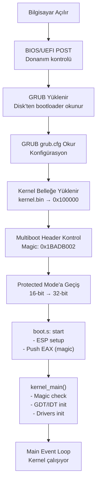

# Boot Process (Başlatma Süreci)

## 📋 İçindekiler

- [Genel Bakış](#genel-bakış)
- [GRUB Bootloader](#grub-bootloader)
- [Multiboot Spesifikasyonu](#multiboot-spesifikasyonu)
- [boot.s - Assembly Entry Point](#boots---assembly-entry-point)
- [Kernel Yüklenmesi](#kernel-yüklenmesi)
- [Stack Kurulumu](#stack-kurulumu)
- [Kernel'e Geçiş](#kernele-geçiş)
- [Boot Süreci Akış Şeması](#boot-süreci-akış-şeması)

---

## Genel Bakış

Boot (başlatma) süreci, bilgisayarın açılmasından kernel'in çalışmaya başlamasına kadar geçen aşamaları kapsar. KFS-1 projesi, GRUB bootloader kullanarak Multiboot standardına uygun şekilde yüklenir.

### Boot Aşamaları:

```
1. BIOS/UEFI POST (Power-On Self Test)
2. Bootloader Yüklenmesi (GRUB)
3. Kernel'in Belleğe Yüklenmesi
4. Multiboot Header Kontrolü
5. Protected Mode'a Geçiş
6. Stack Kurulumu
7. Kernel Entry Point (kernel_main)
```

---

## GRUB Bootloader

**GRUB (GRand Unified Bootloader)**, en yaygın kullanılan açık kaynak bootloader'dır. Multiboot standardını destekler ve birden fazla işletim sistemi yükleyebilir.

### GRUB Yapılandırması

KFS-1 için GRUB konfigürasyonu [`iso/boot/grub/grub.cfg`](../iso/boot/grub/grub.cfg) dosyasında bulunur:

```
menuentry "KFS-1" {
    multiboot /boot/kernel.bin
}
```

### GRUB'un Yaptıkları:

1. **Protected Mode'a geçiş** (16-bit → 32-bit)
2. **A20 hattını etkinleştirme** (1MB üzeri bellek erişimi)
3. **Multiboot bilgilerini hazırlama**
4. **Kernel'i belleğe yükleme** (varsayılan: 0x100000 / 1MB)
5. **Kontrol kernel'e aktarma**

---

## Multiboot Spesifikasyonu

Multiboot, bootloader ve kernel arasındaki standart bir arayüzdür. Bu sayede kernel, farklı bootloader'lar (GRUB, LILO, vb.) ile çalışabilir.

### Multiboot Header

Kernel'in ilk 8KB'sında **Multiboot Header** bulunmalıdır:

```c
MULTIBOOT_MAGIC     = 0x1BADB002
MULTIBOOT_FLAGS     = 0x00000003    // Page align + Memory info
MULTIBOOT_CHECKSUM  = -(MAGIC + FLAGS)
```

Header yapısı:

```asm
align 4
dd MULTIBOOT_MAGIC
dd MULTIBOOT_FLAGS
dd MULTIBOOT_CHECKSUM
```

### Bootloader'ın Kernel'e Aktardığı Bilgiler:

GRUB, kernel'e çağrı yaparken **EAX** registerında **magic number** (0x2BADB002) gönderir:

- **EAX**: `0x2BADB002` (Multiboot magic)
- **EBX**: Multiboot info structure adresi (kullanılmıyor şu anda)
- **ESP**: Stack pointer (bootloader tarafından set edilmiş olabilir)

**Önemli:** Kernel, EAX'teki magic number'ı kontrol etmelidir!

Detaylı bilgi için: [MULTIBOOT.md](MULTIBOOT.md)

---

## boot.s - Assembly Entry Point

[`arch/boot/boot.s`](../arch/boot/boot.s) dosyası, kernel'in ilk çalışan kodudur.

### Boot.s Yapısı:

```asm
BITS 32
GLOBAL start
GLOBAL stack_bottom
GLOBAL stack_top
EXTERN kernel_main

SECTION .multiboot
align 4
    dd MULTIBOOT_MAGIC
    dd MULTIBOOT_FLAGS
    dd MULTIBOOT_CHECKSUM

SECTION .bss
align 16
stack_bottom:
    resb 16384        ; 16KB stack
stack_top:

SECTION .text
start:
    mov esp, stack_top    ; Stack pointer'ı ayarla
    push eax              ; Magic number'ı stack'e push et
    call kernel_main      ; C kernel fonksiyonunu çağır

.hang:
    cli                   ; Interrupt'ları kapat
    hlt                   ; CPU'yu durdur
    jmp .hang            ; Sonsuz döngü
```

### Bölümler:

1. **`.multiboot`**: Multiboot header (GRUB için)
2. **`.bss`**: Uninitialized data (stack alanı)
3. **`.text`**: Executable code (start fonksiyonu)

---

## Kernel Yüklenmesi

### Bellek Düzeni (Boot Sonrası):

```
0x00000000 - 0x000003FF   Real Mode IVT (GRUB tarafından kullanılmaz)
0x00000400 - 0x000004FF   BIOS Data Area
0x00000500 - 0x00007BFF   Free memory
0x00007C00 - 0x00007DFF   GRUB Stage 1
0x00008000 - 0x0009FFFF   GRUB Stage 2 & modules
0x000A0000 - 0x000BFFFF   Video memory (VGA buffer: 0xB8000)
0x000C0000 - 0x000FFFFF   BIOS ROM
0x00100000 - ...          Kernel yüklenir (1MB, linker script)
```

### Linker Script

[`arch/boot/linker.ld`](../arch/boot/linker.ld) kernel'in bellekteki yerini belirler:

```ld
ENTRY(start)

SECTIONS {
    . = 0x00100000;    /* Kernel 1MB'den başlar */
    
    .text ALIGN(4K) : {
        *(.multiboot)   /* Multiboot header önce */
        *(.text)        /* Kod segmenti */
    }
    
    .data ALIGN(4K) : {
        *(.data)
    }
    
    .bss ALIGN(4K) : {
        *(.bss)
    }
}
```

---

## Stack Kurulumu

Stack, fonksiyon çağrıları, yerel değişkenler ve return adresleri için kullanılır.

### Stack Özellikleri:

- **Boyut**: 16KB (16384 bytes)
- **Hizalama**: 16-byte aligned (SSE komutları için)
- **Yön**: Yüksek adresten düşük adrese büyür (downward)
- **Konum**: `.bss` section (uninitialized data)

### Stack Pointer (ESP):

```asm
mov esp, stack_top    ; ESP = stack'in en üst adresi
```

**Önemli:** Stack pointer, stack'in **en üstünden** (highest address) başlar ve aşağı doğru büyür.

```
stack_top    ─────►  0x00123456   ← ESP başlangıç
                     0x00123455
                     0x00123454
                     ...
stack_bottom ─────►  0x0011F456
```

---

## Kernel'e Geçiş

### Çağrı Sırası:

1. **GRUB çalışır**
   - Protected mode'a geçer
   - Kernel'i 0x100000'e yükler
   - EAX'e magic number (0x2BADB002) yazar

2. **start: fonksiyonu çalışır** (boot.s)
   ```asm
   mov esp, stack_top    ; Stack hazır
   push eax              ; Magic number'ı argüman olarak push et
   call kernel_main      ; C fonksiyonuna geç
   ```

3. **kernel_main çalışır** (kernel.c)
   ```c
   void kernel_main(uint32_t magic) {
       if (magic != 0x2BADB002) {
           // Hata: GRUB değil!
           while (1) hlt();
       }
       
       // Kernel başlatma...
   }
   ```

---

## Boot Süreci Akış Şeması



---

## Debug: Boot Sürecini İzleme

### QEMU ile Debug:

```bash
# QEMU'yu GDB server modunda başlat
qemu-system-i386 -cdrom kfs.iso -s -S

# Başka terminalde GDB
gdb build/kernel.bin
(gdb) target remote localhost:1234
(gdb) break start          # boot.s entry point
(gdb) break kernel_main    # C kernel entry
(gdb) continue
```

### Register'ları Kontrol:

```gdb
(gdb) info registers
eax            0x2badb002    # Multiboot magic ✓
ebx            0x...         # Multiboot info pointer
esp            0x...         # Stack pointer
eip            0x100000      # Instruction pointer (kernel start)
```

---

## Özet

1. **BIOS/UEFI** → Bootloader'ı yükler
2. **GRUB** → Protected mode + Kernel'i belleğe yükler
3. **Multiboot Header** → GRUB ve kernel arasında iletişim
4. **boot.s** → Stack setup + kernel_main çağrısı
5. **kernel_main** → Kernel başlatma ve initiailization
6. **Main Loop** → Kernel çalışıyor

**Sonuç:** Boot süreci, donanımdan kernel'e kadar olan kritik geçiş aşamasıdır!

---

[⬅️ Ana Sayfa](README.md) | [Protected Mode ➡️](protected-mode.md) | [Multiboot Detay ➡️](MULTIBOOT.md)
