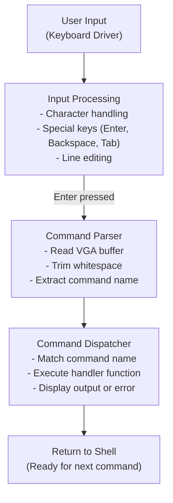

# Shell Implementation

## 📋 İçindekiler

- [Genel Bakış](#genel-bakış)
- [Shell Mimarisi](#shell-mimarisi)
- [Komut İşleme](#komut-i̇şleme)
- [Command History](#command-history)
- [Line Editing](#line-editing)
- [Built-in Commands](#built-in-commands)
- [Eklenti Sistemi](#eklenti-sistemi)

---

## Genel Bakış

KFS-1 Shell, kernel içinde çalışan minimal bir komut satırı arayüzüdür. Kullanıcı etkileşimi, debugging ve sistem kontrolü için tasarlanmıştır.

### Özellikler:

- ✅ Interactive command-line interface
- ✅ Command parsing and execution
- ✅ Command history (navigate with Tab/Arrow keys)
- ✅ Line editing (Insert, Delete, Backspace)
- ✅ Built-in commands (help, clear, stack, reboot, halt)
- ✅ Extensible command system

---

## Shell Mimarisi



---

## Komut İşleme

### Command Enter Flow:

```c
// hw/shell/shell.c
void command_enter(void) {
    char vga_buf[VGA_WIDTH + 1];
    
    // 1. History'ye kaydet
    add_history_entry();
    
    // 2. VGA buffer'dan komutu oku
    read_vga(vga_buf);
    
    // 3. History'ye ekle
    add_history(vga_buf);
    
    // 4. Cursor'ı yeni satıra taşı
    cursor_y++;
    cursor_x = 0;
    if (cursor_y == VGA_HEIGHT)
        scroll();
    
    // 5. Komutu işle
    process_command(vga_buf);
}
```

### Command Processing:

```c
void process_command(char *vga_buf) {
    char command[VGA_WIDTH + 1];
    
    // Whitespace'leri trim et
    trim(command, vga_buf);
    
    // Boş komut mu?
    if (command[0] == '\0')
        return;
    
    // Komut eşleştirme
    if (!strcmp(command, "help"))
        cmd_help();
    else if (!strcmp(command, "clear"))
        cmd_clear();
    else if (!strcmp(command, "stack"))
        print_stack();
    else if (!strcmp(command, "reboot"))
        reboot();
    else if (!strcmp(command, "halt"))
        halt();
    else
        printf("Unknown command: '%s'\nType 'help' for available commands.\n", command);
}
```

---

## Command History

Shell, girilen komutları bellekte tutar ve Tab/Arrow tuşları ile gezinmeyi sağlar.

### History Buffer:

```c
// hw/screen/screen.c
#define HISTORY_SIZE 10
#define HISTORY_LINE_SIZE (VGA_WIDTH + 1)

static char history[HISTORY_SIZE][HISTORY_LINE_SIZE];
static int history_index = 0;
static int history_count = 0;
```

### Add to History:

```c
void add_history(char *line) {
    if (line[0] == '\0')
        return;  // Boş satır kaydetme
    
    // Circular buffer mantığı
    strcpy(history[history_index], line);
    history_index = (history_index + 1) % HISTORY_SIZE;
    
    if (history_count < HISTORY_SIZE)
        history_count++;
}
```

### Navigate History:

```c
void navigate_history(int direction) {
    // direction: 72 = UP, 80 = DOWN
    
    if (history_count == 0)
        return;
    
    static int current = 0;
    
    if (direction == 72) {  // UP
        current = (current > 0) ? current - 1 : history_count - 1;
    } else {  // DOWN
        current = (current + 1) % history_count;
    }
    
    // History'den komutu VGA'ya yaz
    restore_history_line(current);
}
```

---

## Line Editing

### Karakter Ekleme (Insert):

Cursor pozisyonuna karakter eklemek için, sağdaki karakterleri kaydırmalıyız:

```c
void shift_right_line(void) {
    // Cursor'dan sonraki karakterleri sağa kaydır
    for (int x = VGA_WIDTH - 1; x > cursor_x; x--) {
        int src = cursor_y * VGA_WIDTH + x - 1;
        int dst = cursor_y * VGA_WIDTH + x;
        vga_buffer[dst] = vga_buffer[src];
    }
}
```

### Karakter Silme (Delete):

```c
void shift_left_line(void) {
    // Cursor'dan sonraki karakterleri sola kaydır
    for (int x = cursor_x; x < VGA_WIDTH - 1; x++) {
        int src = cursor_y * VGA_WIDTH + x + 1;
        int dst = cursor_y * VGA_WIDTH + x;
        vga_buffer[dst] = vga_buffer[src];
    }
    
    // Son karakteri boşluk yap
    int last = cursor_y * VGA_WIDTH + VGA_WIDTH - 1;
    vga_buffer[last] = (' ' | (vga_color << 8));
}
```

### Backspace:

```c
if (c == '\b' && cursor_x > 0) {
    cursor_x--;
    shift_left_line();
    vga_update_hw_cursor();
}
```

---

## Built-in Commands

### help - Komut Listesi:

```c
void cmd_help(void) {
    printf("KFS-1 Shell - Available Commands:\n");
    printf("  help     - Display this help message\n");
    printf("  clear    - Clear the screen\n");
    printf("  stack    - Print kernel stack dump\n");
    printf("  reboot   - Reboot the system\n");
    printf("  halt     - Halt the system\n");
}
```

### clear - Ekranı Temizle:

```c
void cmd_clear(void) {
    screen_reset_active(-1);  // Tüm buffer'ı sıfırla
    screen_apply_active();     // Ekrana uygula
}
```

### stack - Stack Bilgisi:

```c
void print_stack(void) {
    uint32_t *esp, *ebp;
    
    asm volatile("mov %%esp, %0": "=r"(esp):);
    asm volatile("mov %%ebp, %0": "=r"(ebp):);
    
    printf("Kernel Stack Information:\n");
    printf("  EBP:          0x%x\n", (uint32_t)ebp);
    printf("  ESP:          0x%x\n", (uint32_t)esp);
    printf("  STACK_TOP:    0x%x\n", (uint32_t)&stack_top);
    printf("  STACK_BOTTOM: 0x%x\n", (uint32_t)&stack_bottom);
    printf("  Stack Size:   %d bytes\n", 
           (uint32_t)&stack_top - (uint32_t)&stack_bottom);
    printf("  Stack Used:   %d bytes\n", 
           (uint32_t)&stack_top - (uint32_t)esp);
}
```

### reboot - Sistem Yeniden Başlatma:

```c
void reboot(void) {
    printf("Rebooting system...\n");
    outb(0xCF9, 0x02);   // Reset enable
    outb(0xCF9, 0x06);   // Hard reset
}
```

### halt - Sistemi Durdurma:

```c
void halt(void) {
    printf("System halted. You can now power off.\n");
    asm volatile("cli");  // Interrupt'ları kapat
    asm volatile("hlt");  // CPU'yu durdur
}
```

---

## Eklenti Sistemi

### Yeni Komut Ekleme:

1. **Handler fonksiyonu yaz** (`commands.c`):

```c
void cmd_version(void) {
    printf("KFS-1 Kernel Version 1.0.0\n");
    printf("Build Date: %s %s\n", __DATE__, __TIME__);
}
```

2. **Header'a ekle** (`shell.h`):

```c
void cmd_version(void);
```

3. **Dispatcher'a ekle** (`shell.c`):

```c
void process_command(char *vga_buf) {
    // ...existing code...
    else if (!strcmp(command, "version"))
        cmd_version();
    // ...existing code...
}
```

### F-Key Binding:

```c
// hw/keyboard/f_keys.c
void f1_handler(void) {
    cmd_help();  // F1 = help
}

void f2_handler(void) {
    cmd_clear();  // F2 = clear
}

void f_keys_init(void) {
    f_keys[0] = f1_handler;   // F1
    f_keys[1] = f2_handler;   // F2
    f_keys[2] = print_stack;  // F3
    // ...
}
```

---

## Gelecek Geliştirmeler

### Argüman Parsing:

```c
// Örnek: ls /home veya echo "hello world"
typedef struct {
    char *name;
    char **args;
    int argc;
} command_t;

command_t parse_command(char *line);
```

### Pipe ve Redirection:

```c
// Örnek: command1 | command2
// Örnek: command > file.txt
```

### Environment Variables:

```c
// Örnek: echo $PATH
char *getenv(const char *name);
void setenv(const char *name, const char *value);
```

### Tab Completion:

```c
// Partial command match
void autocomplete(char *partial);
```

---

## Özet

1. **Kullanıcı** → Tuşa basar
2. **Keyboard Driver** → Karakter ekrana yazılır
3. **Enter** → Command processing başlar
4. **Parser** → Komutu ayıklar ve temizler
5. **Dispatcher** → İlgili handler'ı çağırır
6. **Handler** → Komutu çalıştırır
7. **Shell** → Yeni komut için hazır

**Sonuç:** Basit ama genişletilebilir bir shell sistemi!

---

[⬅️ Ana Sayfa](README.md) | [Keyboard ➡️](keyboard.md) | [VGA ➡️](vga.md)
