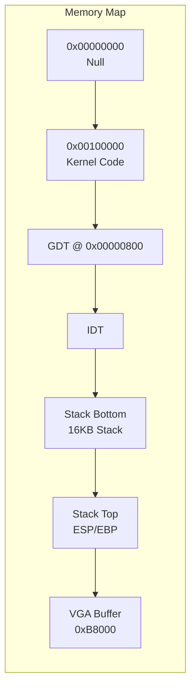
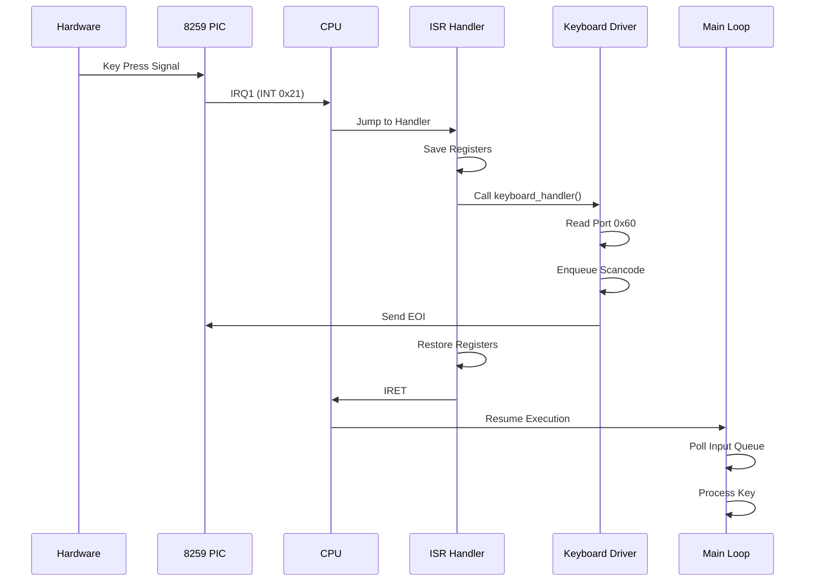
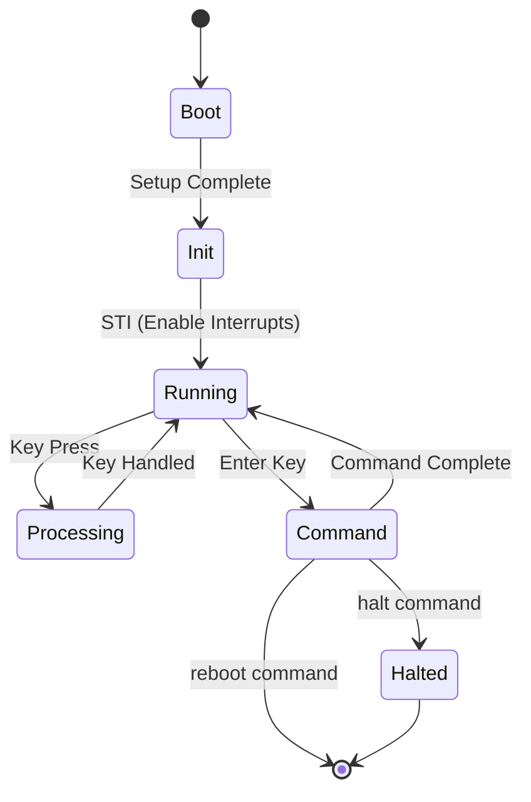

# KFS-1 System Flow Diagram

## Complete System Architecture and Flow

```mermaid
graph TB
    Start([GRUB Bootloader]) --> Boot[boot.s]
    
    Boot --> |Setup Stack| BootStack[Stack Setup<br/>16KB Stack]
    BootStack --> |Push EAX Magic| CallKernel[Call kernel_main]
    
    CallKernel --> KernelMain[kernel_main]
    
    subgraph "Kernel Initialization"
        KernelMain --> CLI1[Disable Interrupts CLI]
        CLI1 --> VGAInit[VGA Initialization<br/>Clear Screen]
        VGAInit --> MultibootCheck{Multiboot Magic<br/>== 0x2BADB002?}
        MultibootCheck -->|No| Error[Display Error<br/>HLT Forever]
        MultibootCheck -->|Yes| GDTInit[GDT Init]
    end
    
    subgraph "GDT Setup"
        GDTInit --> GDTSet[Setup 6 GDT Entries:<br/>NULL, Kernel Code,<br/>Kernel Data, User Code,<br/>User Data]
        GDTSet --> GDTLoad[Load GDT Register]
        GDTLoad --> GDTReload[Reload Segments:<br/>CS=0x08 DS/ES/FS/GS/SS=0x10]
    end
    
    GDTReload --> IDTInit[IDT Init]
    
    subgraph "IDT Setup"
        IDTInit --> IDTSetup[Setup 256 IDT Entries]
        IDTSetup --> IDTLoad[Load IDT Register]
    end
    
    IDTLoad --> PICRemap[PIC Remap<br/>IRQ0-7: 0x20-0x27<br/>IRQ8-15: 0x28-0x2F]
    PICRemap --> PICMask[Mask All IRQs]
    PICMask --> IDTKeyboard[Set IDT Gate 0x21<br/>Keyboard Handler]
    IDTKeyboard --> PICUnmask[Unmask IRQ1<br/>Keyboard]
    PICUnmask --> STI[Enable Interrupts STI]
    
    STI --> ScreenInit[Screen Init<br/>History Buffer]
    ScreenInit --> CursorEnable[Enable VGA Cursor]
    CursorEnable --> MainLoop[Main Event Loop]
    
    subgraph "Main Event Loop"
        MainLoop --> PollInput{Input Available?}
        PollInput -->|Yes| UpdateKeyState[Update Key State]
        PollInput -->|No| HandleRepeat[Handle Key Repeat]
        
        UpdateKeyState --> CheckKeyPress{Key Press?}
        CheckKeyPress -->|Yes| ProcessKey[Process Key]
        CheckKeyPress -->|No| HandleRepeat
        
        ProcessKey --> IsFKey{F1-F10?}
        IsFKey -->|Yes| ExecuteFKey[Execute F-Key Function]
        ExecuteFKey --> UpdateCursor[Update Cursor]
        
        IsFKey -->|No| IsArrow{Arrow Key?}
        IsArrow -->|Yes| HandleArrow[Handle Arrow Navigation]
        HandleArrow --> UpdateCursor
        
        IsArrow -->|No| IsDelete{Delete Key?}
        IsDelete -->|Yes| ShiftLeft[Shift Line Left]
        ShiftLeft --> UpdateCursor
        
        IsDelete -->|No| IsPrintable{Printable Char?}
        IsPrintable -->|Yes| ShiftRight[Shift Line Right]
        ShiftRight --> PutChar[Put Character]
        PutChar --> UpdateCursor
        
        IsPrintable -->|No| IsEnter{Enter Key?}
        IsEnter -->|Yes| ProcessCommand[Process Command]
        IsEnter -->|No| IsTab{Tab Key?}
        
        IsTab -->|Yes| NavigateHistory[Navigate History]
        NavigateHistory --> UpdateCursor
        IsTab -->|No| UpdateCursor
        
        UpdateCursor --> HandleRepeat
        HandleRepeat --> HLT[HLT - Wait for Interrupt]
        HLT --> MainLoop
    end
    
    subgraph "Keyboard Interrupt Flow"
        KeyPress([Hardware: Key Press]) --> IRQ1[IRQ1 Triggered]
        IRQ1 --> ISRStub[isr_irq1_stub<br/>Assembly Handler]
        ISRStub --> SaveRegs[Save Registers]
        SaveRegs --> CallHandler[Call keyboard_handler]
        CallHandler --> ReadPort[Read Port 0x60<br/>Get Scancode]
        ReadPort --> ParseScancode[Parse Scancode<br/>Type & Code]
        ParseScancode --> Enqueue[Enqueue to<br/>Circular Buffer]
        Enqueue --> SendEOI[Send EOI to PIC]
        SendEOI --> RestoreRegs[Restore Registers]
        RestoreRegs --> IRET[IRET Return]
        IRET -.->|Resume| MainLoop
    end
    
    subgraph "Command Processing"
        ProcessCommand --> AddHistory[Add to History]
        AddHistory --> ReadVGA[Read VGA Buffer]
        ReadVGA --> TrimCommand[Trim & Parse Command]
        
        TrimCommand --> IsHelp{help?}
        IsHelp -->|Yes| CmdHelp[Display Help]
        IsHelp -->|No| IsClear{clear?}
        
        IsClear -->|Yes| CmdClear[Clear Screen]
        IsClear -->|No| IsStack{stack?}
        
        IsStack -->|Yes| CmdStack[Print Stack Info:<br/>EBP, ESP,<br/>Stack Top/Bottom,<br/>Usage]
        IsStack -->|No| IsReboot{reboot?}
        
        IsReboot -->|Yes| CmdReboot[Reboot System<br/>Port 0xCF9]
        IsReboot -->|No| IsHalt{halt?}
        
        IsHalt -->|Yes| CmdHalt[Halt System<br/>CLI + HLT]
        IsHalt -->|No| UnknownCmd[Display Unknown<br/>Command Error]
        
        CmdHelp --> ReturnShell[Return to Shell]
        CmdClear --> ReturnShell
        CmdStack --> ReturnShell
        UnknownCmd --> ReturnShell
        
        ReturnShell -.->|Continue| MainLoop
        CmdReboot --> Restart([System Restart])
        CmdHalt --> Stop([System Halted])
    end
    
    style Start fill:#e1f5fe
    style Boot fill:#b3e5fc
    style KernelMain fill:#4fc3f7
    style GDTInit fill:#81c784
    style IDTInit fill:#aed581
    style PICRemap fill:#fff59d
    style MainLoop fill:#ffb74d
    style KeyPress fill:#ef5350
    style ProcessCommand fill:#ba68c8
    style Restart fill:#ff8a65
    style Stop fill:#e57373
    style Error fill:#f44336
```

## Component Descriptions

### Boot Process
- **GRUB**: Multiboot-compliant bootloader loads kernel
- **boot.s**: Sets up 16KB stack, pushes magic number, jumps to kernel_main

### Initialization Phase
1. **GDT (Global Descriptor Table)**: Defines memory segments
   - Null segment (0x00)
   - Kernel Code (0x08)
   - Kernel Data (0x10)
   - User Code (0x18)
   - User Data (0x20)

2. **IDT (Interrupt Descriptor Table)**: Sets up interrupt handlers
   - 256 entries for various interrupts
   - IRQ1 (0x21) configured for keyboard

3. **PIC (Programmable Interrupt Controller)**: Manages hardware interrupts
   - Remaps IRQs to avoid conflicts
   - Enables keyboard interrupt (IRQ1)

### Main Loop
- **Polling-based**: Checks keyboard input buffer
- **Event-driven**: Handles keyboard interrupts
- **Command processing**: Executes shell commands

### Keyboard Handler
- **Interrupt-driven**: Hardware triggers IRQ1
- **Circular buffer**: Queues scancodes
- **State tracking**: Maintains key press/release states

### Shell Commands
- **help**: Shows available commands
- **clear**: Clears screen
- **stack**: Shows kernel stack information
- **reboot**: Restarts system
- **halt**: Stops system

## Memory Layout

## Interrupt Flow

## State Diagram

